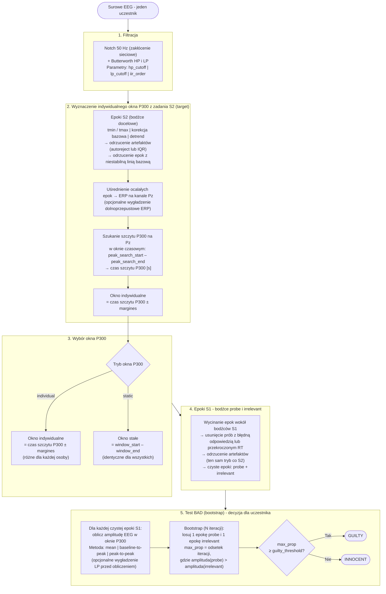
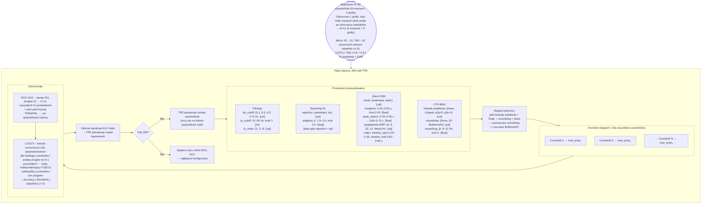
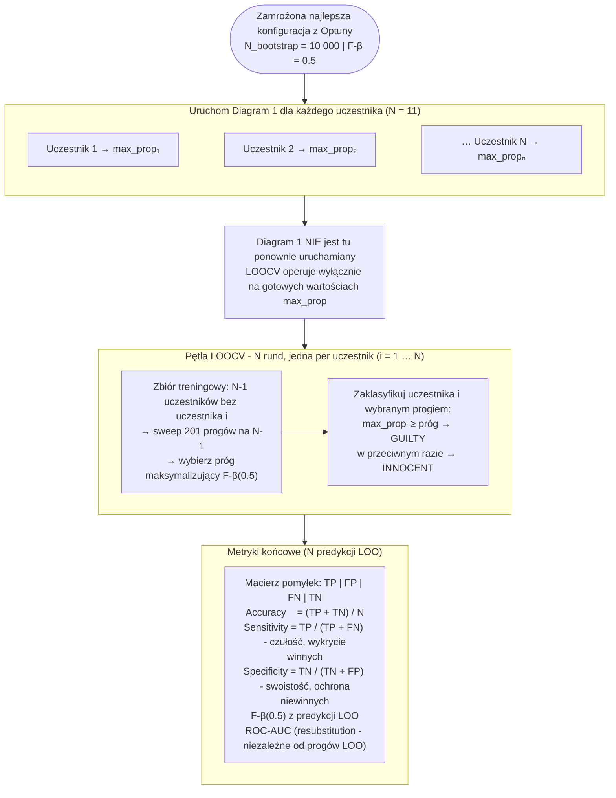
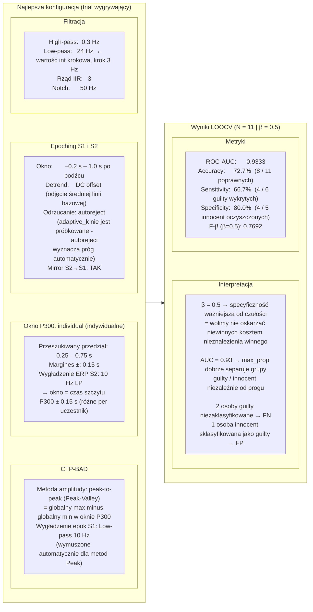

# Pipeline przetwarzania danych - diagramy

---

## Diagram 1 - Przetwarzanie jednego uczestnika

Wykonywany raz per uczestnik: w każdym trialu Optuny i podczas końcowej ewaluacji.

### Opis

Pipeline przetwarza dane jednego uczestnika od surowego sygnału EEG do binarnej decyzji klasyfikacyjnej. Ten sam kod jest wywoływany zarówno w każdym trialu optymalizacji Optuny (Diagram 2), jak i podczas końcowej ewaluacji (Diagram 3).

**Krok 2 - dlaczego korzystamy z zadania S2?**
Każdy uczestnik reaguje inaczej na bodźce - szczyt fali P300 pojawia się w różnym czasie po bodźcu (zwykle 300–600 ms). Zamiast przyjmować stałe okno dla wszystkich, wyznaczamy je indywidualnie: uśredniamy odpowiedzi na bodźce docelowe (S2 target), szukamy szczytu P300 na kanale Pz, a następnie budujemy okno czasowe jako `czas szczytu ± margines`. Zapewnia to precyzyjniejszy pomiar amplitudy P300 per uczestnik.

**Krok 5 - co mierzy test BAD?**
`max_prop` (max_proportion) to odsetek iteracji bootstrapu, w których amplituda EEG po bodźcu „probe" (skradziony przedmiot) przekroczyła amplitudę po bodźcach „irrelevant" (neutralne przedmioty). Wartość bliska 1.0 oznacza, że mózg uczestnika konsekwentnie reaguje silniej na probe - co interpretujemy jako rozpoznanie ukrytej informacji.

**Pojęcia:**

| Termin                | Znaczenie                                                                                                                       |
| --------------------- | ------------------------------------------------------------------------------------------------------------------------------- |
| S1                    | Główne zadanie eksperymentu: uczestnik odpowiada na probe i irrelevant jednakowo, ale mózg „złodzieja" reaguje silniej na probe |
| S2 (target)           | Dodatkowe rzadkie bodźce wplecione w sesję; użytkownik musi zareagować - służą wyłącznie do kalibracji indywidualnego okna P300 |
| probe                 | Bodziec S1 z ukrytą informacją (skradziony przedmiot)                                                                           |
| irrelevant            | Neutralne bodźce S1 (inne przedmioty)                                                                                           |
| max_prop              | Kluczowy wynik BAD: proporcja bootstrapu (0–1)                                                                                  |
| RT                    | Czas reakcji (reaction time)                                                                                                    |
| peak_search_start/end | Granice przeszukiwania szczytu P300 w ERP (w sekundach po bodźcu)                                                               |
| margines              | Połówkowa szerokość okna P300 wokół wyznaczonego szczytu                                                                        |
| guilty_threshold      | Próg decyzyjny dla max_prop - wyznaczany przez LOOCV                                                                            |

---

## Diagram 2 - Optymalizacja Optuna TPE (200 triali)

Szuka kombinacji parametrów o najwyższym ROC-AUC na wszystkich uczestnikach.
Każdy trial = pełny przebieg Diagramu 1 dla każdego uczestnika.

**Ustawienia sesji:** Mirror S2→S1 | LOOCV | F-β = 0.5 | N_bootstrap = 1000 | 200 triali

### Opis

Optuna TPE (Tree-structured Parzen Estimator) to bayesowska metoda optymalizacji. W odróżnieniu od prostego Grid Search, po każdym trialu TPE buduje probabilistyczny model zależności między parametrami a wynikiem - i proponuje kolejne kombinacje z wyższym oczekiwanym AUC. Dzięki temu 200 triali eksploruje przestrzeń bardziej efektywnie niż równoważna siatka.

**Dlaczego ROC-AUC jako cel, a nie Accuracy?**
ROC-AUC mierzy zdolność `max_prop` do odróżnienia grup guilty/innocent niezależnie od wyboru konkretnego progu decyzyjnego. Accuracy zależy od progu - a ten jest zawsze dobierany per fold LOOCV, więc AUC jest bardziej stabilną i uczciwszą miarą do optymalizacji.

**Mirror S2→S1** oznacza, że epoki S2 (kalibracyjne) są wycinane i filtrowane tymi samymi parametrami co epoki S1 (główne) - gwarantuje to spójność preprocessing u między obiema ścieżkami.

**Pojęcia:**

| Termin      | Znaczenie                                                                                        |
| ----------- | ------------------------------------------------------------------------------------------------ |
| TPE         | Tree-structured Parzen Estimator - algorytm bayesowski wybierający następny punkt przeszukiwania |
| [cat]       | Parametr kategoryczny: losowany z podanej listy wartości                                         |
| [int]       | Parametr całkowity z krokiem: np. lp_cutoff ∈ {12, 15, 18, …, 30} Hz                             |
| [float]     | Parametr zmiennoprzecinkowy z krokiem: np. margines ∈ {0.10, 0.15, 0.20} s                       |
| adaptive_k  | Próg odrzucania artefaktów IQR/z-score: wyższe k = mniej agresywne odrzucanie                    |
| b2peak      | baseline-to-peak: amplituda szczytu P300 względem wyzerowanej linii bazowej                      |
| p2p-R       | peak-to-peak (Rosenfeld): szczyt dodatni minus dolina ujemna po nim                              |
| p2p-V       | peak-to-peak (Peak-Valley): globalny max minus globalny min w oknie                              |
| F-β (β=0.5) | Ważona miara F: β < 1 premiuje specyficzność (ochronę niewinnych) ponad czułość                  |
| LOOCV       | Leave-One-Out Cross-Validation - patrz Diagram 3                                                 |

---

## Diagram 3 - Końcowa ewaluacja LOOCV (Quick Pipeline)

Uruchamiany oddzielnie z zamrożonymi parametrami i N_bootstrap = 10 000.
Logika LOOCV jest **identyczna** jak w ocenie każdego trialu Optuny (Diagram 2) - różnica polega wyłącznie na liczbie iteracji bootstrapu (10 000 vs 1 000).

### Opis

Procedura LOOCV jest identyczna z tą w ocenie trialu Optuny. Jedyna różnica to N_bootstrap: **1 000 w Optunie** (szybciej, wyższa wariancja) vs **10 000 tutaj** (wolniej, stabilniejszy wynik `max_prop`). Oznacza to, że wyniki LOOCV z tego kroku mogą nieznacznie różnić się od tych z najlepszego trialu Optuny - to jest zamierzone.

**Pojęcia:**

| Termin             | Znaczenie                                                                                                   |
| ------------------ | ----------------------------------------------------------------------------------------------------------- |
| LOOCV              | Leave-One-Out CV: N foldów, w każdym jeden uczestnik jest walidacyjny, reszta treningowa                    |
| sweep 201 progów   | Dla każdego możliwego progu od 0 do 1 (201 równomiernych kroków) sprawdź F-β na zbiorze treningowym         |
| resubstitution AUC | AUC liczone na wszystkich N wynikach bez podziału na foldy - mierzy separowalność grup, nie zależy od progu |
| Sensitivity        | Czułość = TP / (TP+FN): odsetek rzeczywiście winnych, których poprawnie wykryto                             |
| Specificity        | Swoistość = TN / (TN+FP): odsetek rzeczywiście niewinnych, których poprawnie oczyszczono                    |

---

## Diagram 4 - Najlepsza konfiguracja i wyniki

Najlepsza konfiguracja z 200 triali Optuny. Pokazane metryki pochodzą z oceny **tego konkretnego trialu** (N_bootstrap = 1000 | LOOCV | F-β = 0.5 | Mirror S2→S1) - nie z oddzielnego uruchomienia Quick Pipeline (Diagram 3).

**Macierz pomyłek (N = 11):**

|                           | Pred. GUILTY | Pred. INNOCENT |
| ------------------------- | ------------ | -------------- |
| **Actual GUILTY** (n=6)   | 4 - TP       | 2 - FN         |
| **Actual INNOCENT** (n=5) | 1 - FP       | 4 - TN         |

### Opis

**Jak interpretować wyniki przy N = 11?**
AUC = 0.93 to silny sygnał, że `max_prop` faktycznie rozróżnia grupy. Jednak bezpośrednie metryki (Sensitivity = 66.7%, Accuracy = 72.7%) są umiarkowane - przy N = 11 jedna pomyłka zmienia Accuracy o ~9 p.p., więc wyniki należy traktować ostrożnie. Ważne jest też to, że F-β(0.5) premiuje Specificity: z 5 niewinnych uczestników 4 zostało poprawnie oczyszczonych (FP = 1).